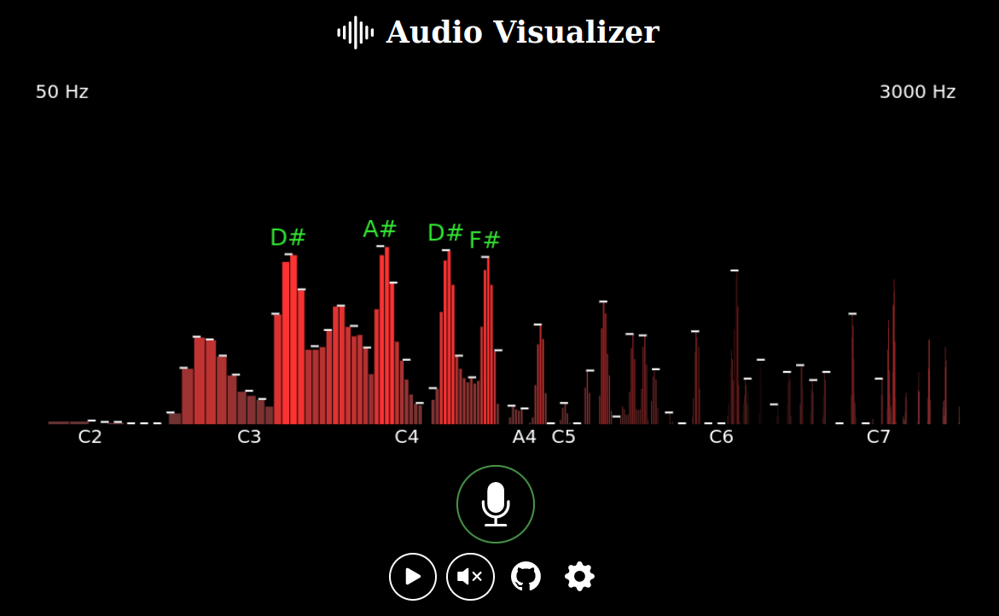
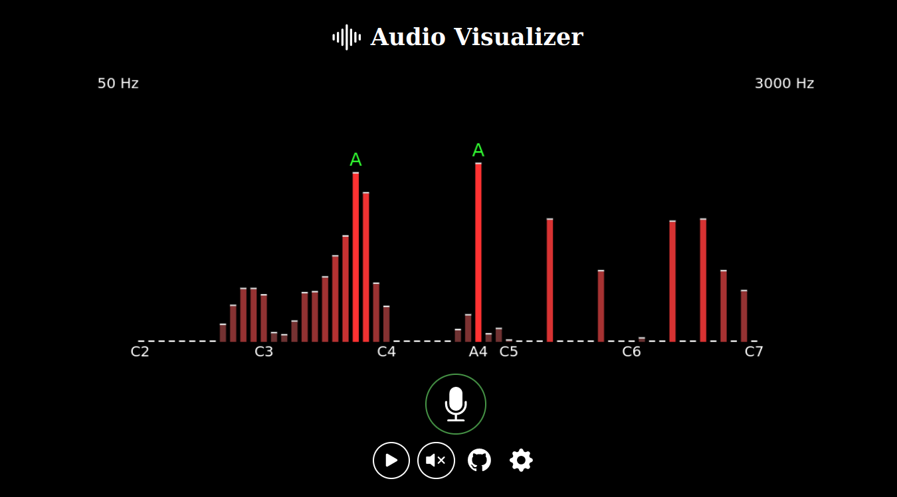

# Audio Visualizer

Audio visualizer and analyzer using Javascript web API. Click for <a href="https://davidmasek.github.io/audio-visualizer/">online demo</a>.

# Credits/Sources

- Based on the [Mozilla Demo](http://mdn.github.io/webaudio-examples/voice-change-o-matic/)
- [Frequencies of musical notes table](https://pages.mtu.edu/~suits/notefreqs.html)
- Web API [analyzer node](https://developer.mozilla.org/en-US/docs/Web/API/AnalyserNode)
- [Bootstrap Icons](https://icons.getbootstrap.com/)
- [Note names, MIDI numbers and frequencies](http://newt.phys.unsw.edu.au/jw/notes.html)